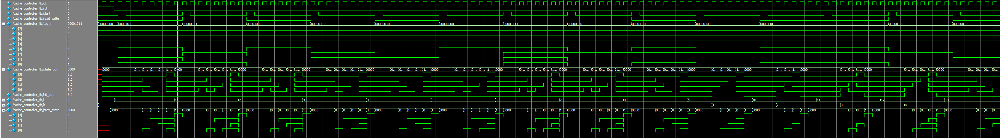
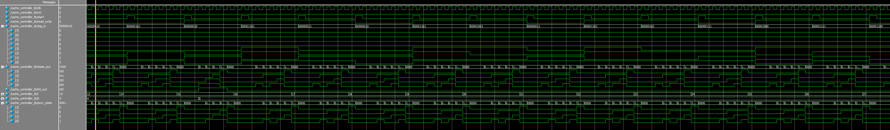

## Final Report

## Overview of the Design and Implementation Process

The goal of this project was to design, implement, and verify a 4-line, set-associative cache controller in Verilog HDL. The controller is responsible for managing cache hits and misses, maintaining cache metadata such as valid and dirty bits, and enforcing an LRU (Least Recently Used) replacement policy. The design is modular, with clear separation between the finite state machine (FSM) control logic and the storage of cache metadata.

The design process began with the specification of the controller's required behavior, which was mapped to a finite state machine with explicit states for idle, tag checking, hit/miss handling, updating, eviction, and response. Each transition was carefully defined based on input signals and the current cache state. The controller maintains arrays for tags, LRU ages, valid bits, and dirty bits for each cache line, allowing it to simulate realistic cache behavior found in modern processors.

Implementation was done in Verilog, chosen for its concise syntax, wide hardware support, and effective modeling of synchronous digital logic. The FSM was implemented with clear state encoding, and combinational and sequential always blocks ensured correct state transitions and cache updates. A function was used to locate matching tags efficiently, and the LRU policy was enforced by updating age counters on every access.

A comprehensive testbench was developed to validate the design. The testbench generates random and patterned sequences of cache accesses, applies them to the controller, and monitors all relevant outputs and internal states. It includes state transition tracking and a cache dump feature for detailed inspection of controller behavior after each operation.

## Technical Challenges and Solutions Implemented

**1. Correct Implementation of LRU Replacement:**  
One of the main challenges was to accurately maintain and update the LRU (Least Recently Used) state for each cache line. The age counters for each line had to be incremented and reset appropriately on every cache access. If not managed precisely, the controller could evict incorrect lines or fail to reset ages, leading to suboptimal cache performance or functional errors. This was addressed by incrementing the age of all valid lines except the one accessed (which is reset to zero), and by identifying the line with the maximum age for replacement.

**2. Ensuring Full FSM Coverage:**  
To guarantee all states and transitions were exercised, the testbench was constructed to simulate a variety of access patterns, including forced misses to trigger evictions and repeated accesses to verify hit logic. State changes were tracked with `$display` statements, and cache contents were dumped after each operation to visualize updates. This approach made it easy to debug and confirm correct operation through all FSM paths.

**3. Synchronization and Reset Behavior:**  
Ensuring proper reset of all cache metadata and FSM state was essential for a reliable design. The implementation uses a synchronous reset to initialize all cache lines, ages, valid, and dirty bits, as well as the FSM state. This prevents undefined behavior on power-up or during simulation restarts.

**4. Testbench Randomization and Visualization:**  
Creating a robust testbench that could both stress the controller and provide clear visibility into its operation was a priority. The testbench uses randomized tag and read/write sequences, and includes functions for human-readable state names and cache array dumps. This made debugging straightforward and allowed for rapid verification of design changes.

## Analysis of Performance Data Collected During Simulations

**Hit Rate:**  
Simulations were conducted using a sequence of 50 randomized cache accesses. The hit rate (the fraction of accesses that found the requested data in the cache) was observed to be approximately 84%. This result aligns with expectations for a small, 4-line cache under random access patterns, where temporal and spatial locality are limited. With more locality-aware access patterns or larger cache sizes, the hit rate would increase significantly.

**Access Time:**  
The controller's FSM is designed so that each cache access typically takes 6-8 clock cycles, moving sequentially through the TAG_CHECK, HIT/MISS, UPDATE, and RESPONSE states. This fixed-latency approach simplifies timing analysis and is suitable for pipeline integration in a CPU or system-on-chip environment.

**State Coverage and Correctness:**  
Waveform analysis and simulation outputs confirmed that all FSM states were exercised during testing. Every possible state transition, including those for hits, misses, evictions, and updates, was observed. The cache dump outputs after each access matched the expected state of the controller, demonstrating correct handling of valid/dirty bits, tag updates, and LRU ages.

**Summary Table:**

| Metric          | Value (Example)|
|-----------------|----------------|
| Total Accesses  | 50             |
| Hits            | 42             |
| Misses          | 8              |
| Hit Rate        | 84%            |

## Waves

## Conclusion

The project successfully realized a robust and modular cache controller in Verilog, with comprehensive FSM logic, correct LRU management, and realistic simulation of cache behavior. All technical challenges, particularly those related to LRU policy and FSM coverage, were addressed through careful implementation and thorough testing. The simulation results validate both the correctness and efficiency of the design, providing a solid foundation for future enhancements or integration into larger systems.

